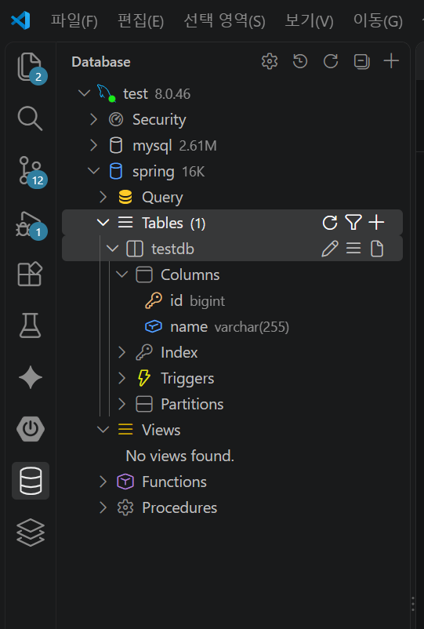
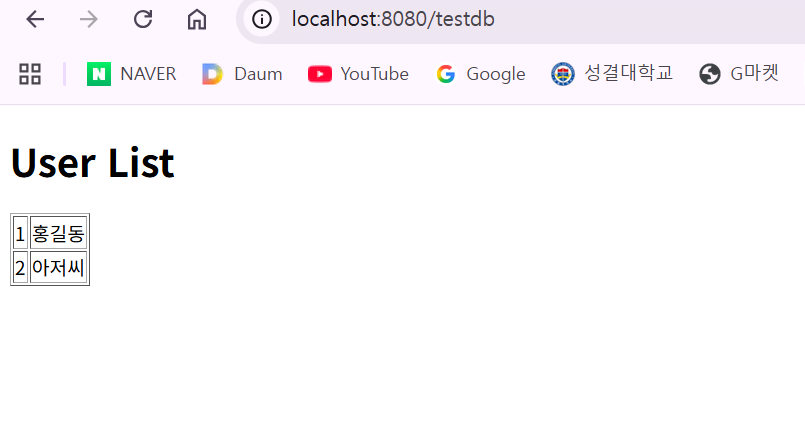
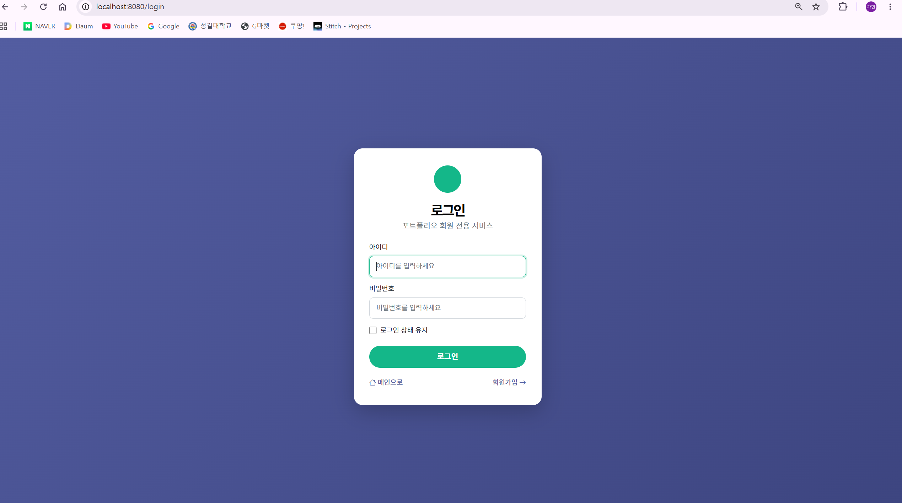
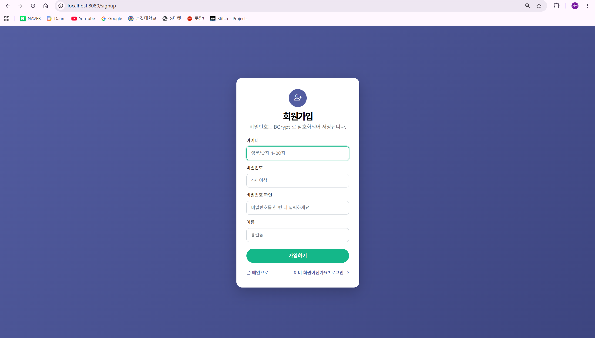
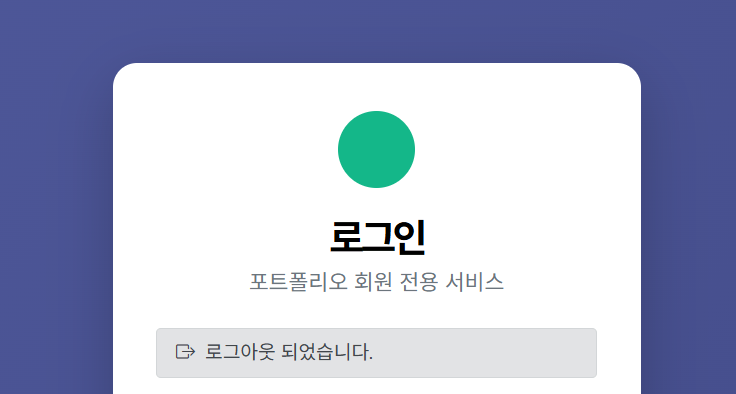
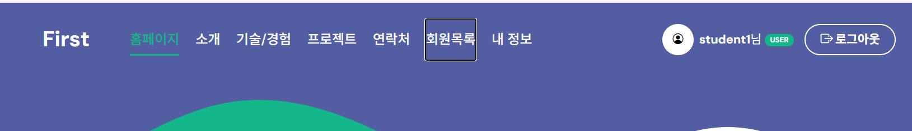
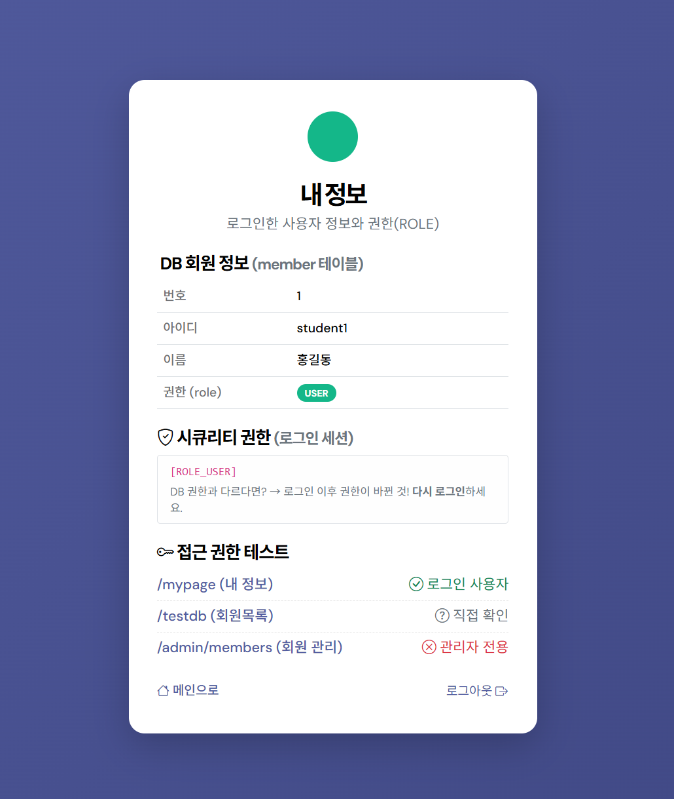
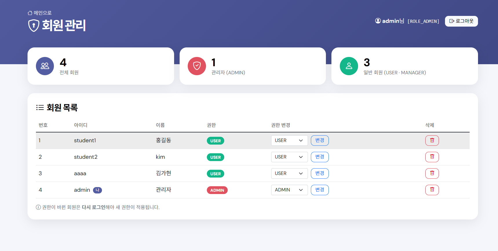
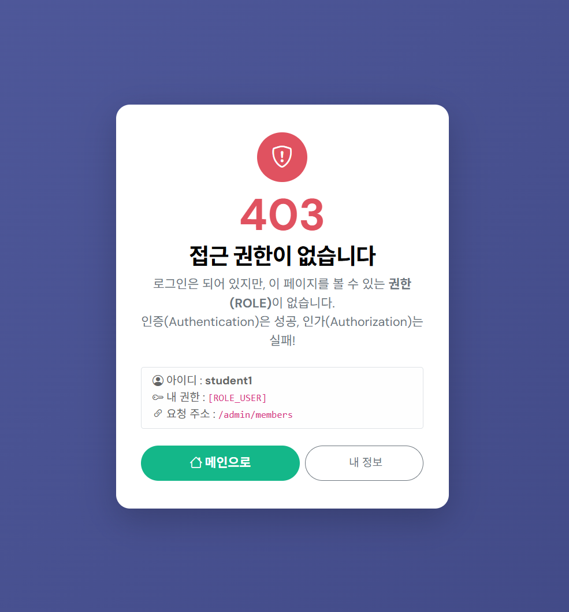

# 자바웹프로그래밍2 20250589 김가현

## 2주차 스프링 부트 개발환경 완료
실습 1: 스프링부트 준비
실습 2: 기본화면 실행하기
실습 3: URL 맵핑과 컨트롤 자바파일 추가

 

## 3주차 포트폴리오 작성하기 완료
실습 1: 포트폴리오 템플릿 저장하기
실습 2: 프로필 수정하기

 

## 4주차 데이터베이스 수정 완료
실습1: 데이터베이스 연동하기
실습2: 컨트롤 구조 이동하고 모델폴더 생성하기
실습3: 테스트db 페이지 만들기

 

## 5주차 로그인/로그아웃, 암호화 완료
실습1: 의존성 모듈 추가하기
실습2: 로그인 페이지 설정하기
실습3: 회원가입 페이지 설정하기

 

## 6주차 권한(ROLE) 접근 제어, 관리자 페이지 분리 완료
실습1: 내 정보 + USER 배지 추가하기
실습2: 내 정보 페이지 만들기
실습3: 관리자 회원 목록 페이지 만들기
실습4: 403 접근 거부 테스트

 